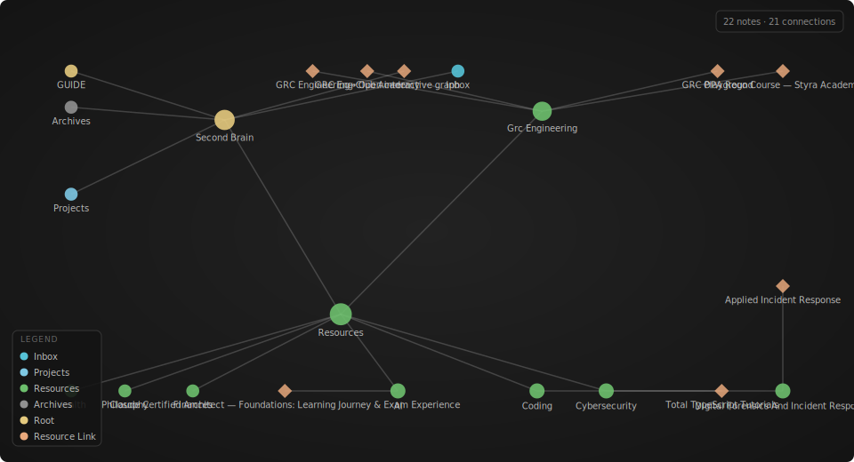

# Second Brain

A personal knowledge management system built on the **PARA method** by Tiago Forte.

## Graph View

[](https://code1sentinel.github.io/second-brain/graph/)

**[→ Open interactive graph](https://code1sentinel.github.io/second-brain/graph/)** — zoom, pan, search notes, click any node to explore connections.

> To activate: go to **Settings → Pages**, set source to `main` branch, `/ (root)` folder.

## Structure

| Folder | Purpose | Note |
|--------|---------|------|
| [00-inbox](./00-inbox/) | Capture everything here first — process later | Clear weekly; nothing lives here permanently |
| [01-projects](./01-projects/) | Active work with a clear goal and deadline | If there's no finish line, it belongs in Resources |
| [03-resources](./03-resources/) | Reference material organised by topic | Knowledge you want to keep regardless of current projects |
| [04-archives](./04-archives/) | Completed projects and inactive material | Archive, never delete — past context is always useful |

**[→ Read the full operating guide](./GUIDE.md)** — CODE workflow, daily habits, progressive summarisation, and principles.

## Workflow

```
Capture → Inbox → Clarify → Organise → Review → Engage
```

1. **Capture** — Dump everything into `00-inbox` without judgment.
2. **Clarify** — Process inbox items: is it actionable? What's the next step?
3. **Organise** — Move to the right PARA folder.
4. **Review** — Weekly sweep of projects and resources; monthly archive pass.
5. **Engage** — Work from your system, not your head.

## Conventions

- File names: `YYYY-MM-DD-title.md` for time-stamped notes, `title.md` for evergreen notes.
- Use tags (`#tag`) freely within notes.
- Link between notes with relative paths: `[note title](../03-resources/topic/note.md)`.
- Archive a project when it's done — don't delete it.
